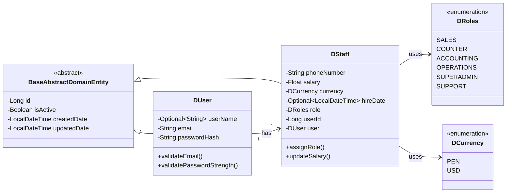

# Design Document: User/Staff Authentication Module

## Overview

This design document outlines the technical architecture for the User/Staff Authentication Module following Domain-Driven Design (DDD) principles with CQRS patterns. The module manages user accounts and staff profiles with a 1:1 relationship, providing the foundation for role-based access control in the PTC Agency Demo system.

The design follows the established Customer module pattern, maintaining consistency across the codebase while adhering to the source of truth domain model.

## Architecture

### Layer Structure

```
users/
├── application/
│   ├── commands/
│   │   ├── CreateUserCommand.java
│   │   ├── CreateStaffCommand.java
│   │   └── handlers/
│   │       ├── CreateUserCommandHandler.java
│   │       └── CreateStaffCommandHandler.java
│   ├── queries/
│   │   ├── GetUserByIdQuery.java
│   │   ├── UserPaginatedQuery.java
│   │   ├── GetStaffByIdQuery.java
│   │   ├── StaffPaginatedQuery.java
│   │   ├── GetStaffByRoleQuery.java
│   │   └── handlers/
│   │       ├── GetUserByIdQueryHandler.java
│   │       ├── UserPaginatedQueryHandler.java
│   │       ├── GetStaffByIdQueryHandler.java
│   │       ├── StaffPaginatedQueryHandler.java
│   │       └── GetStaffByRoleQueryHandler.java
│   └── events/
│       ├── UserCreatedDomainEvent.java
│       └── StaffCreatedDomainEvent.java
├── domain/
│   ├── entities/
│   │   ├── DUser.java
│   │   └── DStaff.java
│   ├── enums/
│   │   ├── DRoles.java
│   │   └── DCurrency.java
│   └── repositories/
│       ├── IUserRepository.java
│       └── IStaffRepository.java
├── infrastructure/
│   ├── entities/
│   │   ├── User.java
│   │   └── Staff.java
│   ├── enums/
│   │   ├── Roles.java
│   │   └── Currency.java
│   ├── mappers/
│   │   ├── IUserLombokMapper.java
│   │   ├── UserLombokMapper.java
│   │   ├── IStaffLombokMapper.java
│   │   └── StaffLombokMapper.java
│   └── repositories/
│       ├── interfaces/
│       │   ├── IUserJpaRepository.java
│       │   └── IStaffJpaRepository.java
│       └── impl/
│           ├── UserRepository.java
│           └── StaffRepository.java
└── presentation/
    ├── controllers/
    │   ├── UserController.java
    │   └── StaffController.java
    └── dto/
        ├── CreateUserDto.java
        ├── UserResponseDto.java
        ├── PaginatedUserRequestDto.java
        ├── CreateStaffDto.java
        ├── StaffResponseDto.java
        └── PaginatedStaffRequestDto.java
```

## Components and Interfaces

### Domain Layer

#### DUser Entity
```java
@Data
@AllArgsConstructor
@NoArgsConstructor
@EqualsAndHashCode(callSuper = true)
public class DUser extends BaseAbstractDomainEntity {
    private Optional<String> userName;
    private String email;
    private String passwordHash;
    
    // Business validation methods
    public void validateEmail() {
        // Email format validation
    }
    
    public void validatePasswordStrength(String password) {
        // Password strength validation
    }
}
```

#### DStaff Entity
```java
@Data
@AllArgsConstructor
@NoArgsConstructor
@EqualsAndHashCode(callSuper = true)
public class DStaff extends BaseAbstractDomainEntity {
    private String phoneNumber;
    private Float salary;
    private DCurrency currency;
    private Optional<LocalDateTime> hireDate;
    private DRoles role;
    private Long userId;
    private DUser user; // Association reference
    
    // Business methods
    public void assignRole(DRoles newRole) {
        // Role assignment logic
    }
    
    public void updateSalary(Float newSalary, DCurrency newCurrency) {
        // Salary update logic
    }
}
```

#### Domain Enumerations

**DRoles.java**
```java
public enum DRoles {
    SALES,
    COUNTER,
    ACCOUNTING,
    OPERATIONS,
    SUPERADMIN,
    SUPPORT
}
```

**DCurrency.java**
```java
public enum DCurrency {
    PEN,
    USD
}
```

#### Repository Interfaces

**IUserRepository.java**
```java
public interface IUserRepository {
    DUser save(DUser user);
    DUser update(DUser user);
    DUser findById(Long id);
    DUser findByEmail(String email);
    Page<DUser> findAll(Pageable pageConfig);
    DUser deleteById(Long id);
    boolean existsByEmail(String email);
}
```

**IStaffRepository.java**
```java
public interface IStaffRepository {
    DStaff save(DStaff staff);
    DStaff update(DStaff staff);
    DStaff findById(Long id);
    DStaff findByUserId(Long userId);
    List<DStaff> findByRole(DRoles role);
    Page<DStaff> findAll(Pageable pageConfig);
    DStaff deleteById(Long id);
}
```

### Infrastructure Layer

#### JPA Entities

**User.java**
```java
@Entity
@Table(name = "users")
@Getter
@Setter
@AllArgsConstructor
@NoArgsConstructor
@SuperBuilder(toBuilder = true)
public class User extends BaseAbstractEntity {
    
    @Column(nullable = true, length = 100, unique = true)
    private String userName;
    
    @Column(nullable = false, length = 255, unique = true)
    private String email;
    
    @Column(nullable = false, length = 255, name = "password_hash")
    private String passwordHash;
    
    @OneToOne(mappedBy = "user", cascade = CascadeType.ALL)
    private Staff staff;
}
```

**Staff.java**
```java
@Entity
@Table(name = "staff")
@Getter
@Setter
@AllArgsConstructor
@NoArgsConstructor
@SuperBuilder(toBuilder = true)
public class Staff extends BaseAbstractEntity {
    
    @Column(nullable = false, length = 20, name = "phone_number")
    private String phoneNumber;
    
    @Column(nullable = false)
    private Float salary;
    
    @Enumerated(EnumType.STRING)
    @Column(nullable = false, length = 10)
    private Currency currency;
    
    @Column(nullable = true, name = "hire_date")
    private LocalDateTime hireDate;
    
    @Enumerated(EnumType.STRING)
    @Column(nullable = false, length = 20)
    private Roles role;
    
    @OneToOne
    @JoinColumn(name = "user_id", nullable = false, unique = true)
    private User user;
}
```

#### MapStruct Mappers

**IUserLombokMapper.java**
```java
@Mapper
public interface IUserLombokMapper {
    User toPersistence(DUser domainUser);
    DUser toDomain(User persistenceUser);
    
    default String mapOptional(Optional<String> value) {
        return value != null && value.isPresent() ? value.get() : null;
    }
    
    default Optional<String> mapString(String value) {
        return Optional.ofNullable(value);
    }
}
```

**IStaffLombokMapper.java**
```java
@Mapper
public interface IStaffLombokMapper {
    Staff toPersistence(DStaff domainStaff);
    DStaff toDomain(Staff persistenceStaff);
    
    default LocalDateTime mapOptional(Optional<LocalDateTime> value) {
        return value != null && value.isPresent() ? value.get() : null;
    }
    
    default Optional<LocalDateTime> mapDateTime(LocalDateTime value) {
        return Optional.ofNullable(value);
    }
    
    // Enum mappings
    Roles map(DRoles role);
    DRoles map(Roles role);
    Currency map(DCurrency currency);
    DCurrency map(Currency currency);
}
```

### Application Layer (CQRS)

#### Commands

**CreateUserCommand.java**
```java
public record CreateUserCommand(CreateUserDto userDto) {}
```

**UpdateUserCommand.java**
```java
public record UpdateUserCommand(Long userId, UpdateUserDto userDto) {}
```

#### Command Handlers

**CreateUserCommandHandler.java**
- Validates email uniqueness
- Hashes password (using BCrypt or similar)
- Creates DUser entity
- Saves via IUserRepository
- Publishes UserCreatedDomainEvent
- Returns created DUser

**UpdateUserCommandHandler.java**
- Retrieves existing user
- Validates changes
- Updates DUser entity
- Saves via IUserRepository
- Publishes UserUpdatedDomainEvent
- Returns updated DUser

#### Queries

**GetUserByIdQuery.java**
```java
public record GetUserByIdQuery(Long userId) {}
```

**UserPaginatedQuery.java**
```java
public record UserPaginatedQuery(PaginatedUserRequestDto requestDto) {}
```

**GetStaffByIdQuery.java**
```java
public record GetStaffByIdQuery(Long staffId) {}
```

**StaffPaginatedQuery.java**
```java
public record StaffPaginatedQuery(PaginatedStaffRequestDto requestDto) {}
```

**GetStaffByRoleQuery.java**
```java
public record GetStaffByRoleQuery(DRoles role) {}
```

#### Query Handlers

**GetUserByIdQueryHandler.java**
- Retrieves user by ID
- Returns DUser or throws exception

**UserPaginatedQueryHandler.java**
- Retrieves paginated user list
- Uses PaginatedUserRequestDto for pagination config
- Returns Page<DUser>

**GetStaffByIdQueryHandler.java**
- Retrieves staff by ID
- Includes associated user data
- Returns DStaff or throws exception

**StaffPaginatedQueryHandler.java**
- Retrieves paginated staff list
- Uses PaginatedStaffRequestDto for pagination config
- Includes associated user data
- Returns Page<DStaff>

**GetStaffByRoleQueryHandler.java**
- Filters staff by role
- Returns List<DStaff>

### Presentation Layer

#### DTOs

**CreateUserDto.java**
```java
@Data
public class CreateUserDto {
    @Email
    @NotBlank
    private String email;
    
    @NotBlank
    @Size(min = 8)
    private String password;
    
    private String userName;
}
```

**CreateStaffDto.java**
```java
@Data
public class CreateStaffDto {
    @NotNull
    private Long userId;
    
    @NotBlank
    private String phoneNumber;
    
    @NotNull
    @Positive
    private Float salary;
    
    @NotNull
    private String currency; // Will be converted to DCurrency
    
    @NotNull
    private String role; // Will be converted to DRoles
    
    private LocalDateTime hireDate;
}
```

**UserResponseDto.java**
```java
@Data
public class UserResponseDto {
    private Long id;
    private String email;
    private String userName;
    private Boolean isActive;
    private LocalDateTime createdDate;
    // Note: passwordHash is NEVER exposed
}
```

**StaffResponseDto.java**
```java
@Data
public class StaffResponseDto {
    private Long id;
    private String phoneNumber;
    private Float salary;
    private String currency;
    private LocalDateTime hireDate;
    private String role;
    private UserResponseDto user;
    private Boolean isActive;
}
```

**PaginatedUserRequestDto.java**
```java
@NoArgsConstructor
@JsonNaming(PropertyNamingStrategies.SnakeCaseStrategy.class)
@TypeAlias("PaginatedUserRequestDto")
@Getter
@Setter
public class PaginatedUserRequestDto extends PaginatedRequestDto {
    public PaginatedUserRequestDto(int page, int size) {
        super(page, size);
    }
}
```

**PaginatedStaffRequestDto.java**
```java
@NoArgsConstructor
@JsonNaming(PropertyNamingStrategies.SnakeCaseStrategy.class)
@TypeAlias("PaginatedStaffRequestDto")
@Getter
@Setter
public class PaginatedStaffRequestDto extends PaginatedRequestDto {
    public PaginatedStaffRequestDto(int page, int size) {
        super(page, size);
    }
}
```

#### Controllers

**UserController.java**
```java
@RestController
@RequestMapping("/users")
@Tag(name = "Users", description = "Endpoints para el manejo de usuarios")
public class UserController extends BaseV1Controller {
    
    private final CreateUserCommandHandler createUserCommandHandler;
    private final GetUserByIdQueryHandler getUserByIdQueryHandler;
    private final UserPaginatedQueryHandler userPaginatedQueryHandler;
    
    public UserController(CreateUserCommandHandler createUserCommandHandler,
                         GetUserByIdQueryHandler getUserByIdQueryHandler,
                         UserPaginatedQueryHandler userPaginatedQueryHandler) {
        this.createUserCommandHandler = createUserCommandHandler;
        this.getUserByIdQueryHandler = getUserByIdQueryHandler;
        this.userPaginatedQueryHandler = userPaginatedQueryHandler;
    }
    
    @PostMapping
    @Operation(summary = "Crear un nuevo usuario")
    public DUser createUser(@Valid @RequestBody CreateUserDto dto) {
        return createUserCommandHandler.execute(new CreateUserCommand(dto));
    }
    
    @GetMapping("/{id}")
    @Operation(summary = "Obtener usuario por ID")
    public DUser getUserById(@PathVariable Long id) {
        return getUserByIdQueryHandler.execute(new GetUserByIdQuery(id));
    }
    
    @GetMapping("/paginados")
    @Operation(summary = "Obtener usuarios paginados")
    public Page<DUser> getPaginatedUsers(@ModelAttribute PaginatedUserRequestDto requestDto) {
        requestDto.normalizePageNumber();
        UserPaginatedQuery query = new UserPaginatedQuery(requestDto);
        return userPaginatedQueryHandler.execute(query);
    }
}
```

**StaffController.java**
```java
@RestController
@RequestMapping("/staff")
@Tag(name = "Staff", description = "Endpoints para el manejo de personal")
public class StaffController extends BaseV1Controller {
    
    private final CreateStaffCommandHandler createStaffCommandHandler;
    private final GetStaffByIdQueryHandler getStaffByIdQueryHandler;
    private final StaffPaginatedQueryHandler staffPaginatedQueryHandler;
    private final GetStaffByRoleQueryHandler getStaffByRoleQueryHandler;
    
    public StaffController(CreateStaffCommandHandler createStaffCommandHandler,
                          GetStaffByIdQueryHandler getStaffByIdQueryHandler,
                          StaffPaginatedQueryHandler staffPaginatedQueryHandler,
                          GetStaffByRoleQueryHandler getStaffByRoleQueryHandler) {
        this.createStaffCommandHandler = createStaffCommandHandler;
        this.getStaffByIdQueryHandler = getStaffByIdQueryHandler;
        this.staffPaginatedQueryHandler = staffPaginatedQueryHandler;
        this.getStaffByRoleQueryHandler = getStaffByRoleQueryHandler;
    }
    
    @PostMapping
    @Operation(summary = "Crear un nuevo staff")
    public DStaff createStaff(@Valid @RequestBody CreateStaffDto dto) {
        return createStaffCommandHandler.execute(new CreateStaffCommand(dto));
    }
    
    @GetMapping("/{id}")
    @Operation(summary = "Obtener staff por ID")
    public DStaff getStaffById(@PathVariable Long id) {
        return getStaffByIdQueryHandler.execute(new GetStaffByIdQuery(id));
    }
    
    @GetMapping("/paginados")
    @Operation(summary = "Obtener staff paginado")
    public Page<DStaff> getPaginatedStaff(@ModelAttribute PaginatedStaffRequestDto requestDto) {
        requestDto.normalizePageNumber();
        StaffPaginatedQuery query = new StaffPaginatedQuery(requestDto);
        return staffPaginatedQueryHandler.execute(query);
    }
    
    @GetMapping("/by-role/{role}")
    @Operation(summary = "Obtener staff por rol")
    public List<DStaff> getStaffByRole(@PathVariable String role) {
        DRoles dRole = DRoles.valueOf(role.toUpperCase());
        return getStaffByRoleQueryHandler.execute(new GetStaffByRoleQuery(dRole));
    }
}
```

## Data Models

### Database Schema

**users table**
```sql
CREATE TABLE users (
    id BIGSERIAL PRIMARY KEY,
    user_name VARCHAR(100) UNIQUE,
    email VARCHAR(255) NOT NULL UNIQUE,
    password_hash VARCHAR(255) NOT NULL,
    is_active BOOLEAN DEFAULT true,
    created_date TIMESTAMP DEFAULT CURRENT_TIMESTAMP,
    updated_date TIMESTAMP DEFAULT CURRENT_TIMESTAMP
);
```

**staff table**
```sql
CREATE TABLE staff (
    id BIGSERIAL PRIMARY KEY,
    phone_number VARCHAR(20) NOT NULL,
    salary DECIMAL(10,2) NOT NULL,
    currency VARCHAR(10) NOT NULL,
    hire_date TIMESTAMP,
    role VARCHAR(20) NOT NULL,
    user_id BIGINT NOT NULL UNIQUE,
    is_active BOOLEAN DEFAULT true,
    created_date TIMESTAMP DEFAULT CURRENT_TIMESTAMP,
    updated_date TIMESTAMP DEFAULT CURRENT_TIMESTAMP,
    FOREIGN KEY (user_id) REFERENCES users(id) ON DELETE CASCADE
);
```

### Entity Relationships



## Error Handling

### Domain Validation Errors
- Invalid email format
- Weak password
- Duplicate email
- Invalid role assignment
- Missing required user reference

### Application Layer Errors
- User not found
- Staff not found
- Unauthorized access (future)
- Invalid command data

### Infrastructure Layer Errors
- Database connection failures
- Constraint violations
- Transaction rollbacks

### Error Response Format
```json
{
    "timestamp": "2025-10-26T10:30:00",
    "status": 400,
    "error": "Bad Request",
    "message": "Email already exists",
    "path": "/users"
}
```

## Testing Strategy

### Unit Tests
- **Domain Entities**: Test business logic methods
  - Email validation
  - Password strength validation
  - Role assignment
  - Salary updates

### Integration Tests
- **Command Handlers**: Test complete command execution flow
  - CreateUserCommandHandler with repository
  - UpdateUserCommandHandler with event publishing
  
- **Query Handlers**: Test query execution
  - GetUserByIdQueryHandler
  - GetAllStaffQueryHandler with pagination
  - GetStaffByRoleQueryHandler with filtering

### Repository Tests
- **UserRepository**: Test CRUD operations with test containers
- **StaffRepository**: Test relationship handling and queries

### Controller Tests
- **UserController**: Test REST endpoints with MockMvc
- **StaffController**: Test pagination and filtering endpoints

## Security Considerations

### Password Handling
- Passwords are hashed using BCrypt before storage
- Password hashes are never exposed in responses
- Minimum password length: 8 characters
- Password strength validation in domain layer

### Data Protection
- Email uniqueness enforced at database level
- Sensitive data (passwordHash) excluded from DTOs
- Input validation at all layers

### Future Enhancements
- JWT token-based authentication
- Spring Security integration
- Role-based endpoint protection
- Password reset functionality
- Account lockout after failed attempts

## Implementation Notes

### Mapping Strategy
- Use MapStruct for automatic mapping between layers
- Handle Optional<T> conversions explicitly
- Map enums bidirectionally between domain and infrastructure

### Transaction Boundaries
- Command handlers are transactional
- Query handlers are read-only
- Repository operations are atomic

### Event Publishing
- Domain events published after successful command execution
- Events can trigger async processes (future)
- Follow existing CustomerCreatedDomainEvent pattern

### Consistency with Customer Module
- Follow same package structure
- Use same naming conventions (D* prefix for domain)
- Implement same repository pattern
- Use same DTO validation approach
- Follow same controller response patterns
