# Domain Model Blueprint

This Mermaid class diagram serves as the single source of truth for the domain model. All implementations must strictly follow this blueprint.

## Implementation Rules
- Domain entities use `D*` prefix (e.g., `DCustomer`, `DLiquidation`)
- Infrastructure entities have no prefix (e.g., `Customer`, `Liquidation`)
- All entities extend `BaseAbstractDomainEntity`
- Enums use `D*` prefix in domain layer, no prefix in infrastructure
- Relationships must match cardinalities exactly as specified
- Business methods are mandatory and must be implemented in domain entities

```mermaid
classDiagram
    direction TB

    %% --- ENUMERATIONS ---
    class Currency {
        <<enumeration>>
        PEN
        USD
    }
    class ServiceStatus {
        <<enumeration>>
        PENDING
        COMPLETED
        CANCELED
    }
    class PaymentMethod {
        <<enumeration>>
        DEBIT
        CREDIT
        YAPE
        OTHER
    }
    class IdDocType {
        <<enumeration>>
        DNI
        RUC
        CE
        PASSPORT
    }
    class LiquidationStatus {
      <<enumeration>>
      IN_QUOTE
      PENDING
      ON_COURSE
      COMPLETED
    }
    class PaymentStatus {
      <<enumeration>>
      PENDING
      ON_COURSE
      COMPLETED
    }
    class Roles {
      <<enumeration>>
      SALES
      COUNTER
      ACCOUNTING
      OPERATIONS
      SUPERADMIN
      SUPPORT
    }
    class IncidencyStatus {
      <<enumeration>>
      PENDING
      APPROVED
      REJECTED
    }
    class NotificationScope {
      <<enumeration>>
      ALL
      OTHERS
      SELF
    }
    class PaymentValidity {
      <<enumeration>>
      VALID
      INVALID
    }

    %% --- Base Abstract Entity ---
    class BaseAbstractDomainEntity {
        <<abstract>>
        -Id: String
        -isActive: boolean
        -createdAt: DateTime
        -updatedAt: DateTime
    }

    %% --- Core Entities (User/Customer Context) ---
    class Customer {
      %% Already implemented - reference only
    }
    class BankAccount {
      %% Already implemented - reference only
    }
    class User {
        -Id: String
        -userName: Optional~String~
        -email: String
        -passwordHash: String
    }
    class Staff {
        -Id: String
        -phoneNumber: String
        -salary: float
        -currency: Currency
        -hireDate: Optional~Datetime~
        -userId: String
        -user: User
    }
    class Notification {
        -Id: String
        -message: String
        -scope: NotificationScope
        -referenceId: Optional~String~
    }
    class UserNotification {
        -Id: String
        -read: Boolean
        -userId: String
        -notificationId: String
        -notification: Notification
    }
    class Incidency {
        -Id: String
        -reason: String
        -amount: Optional~float~
        -incidencyDate: Datetime
        -incidencyStatus: IncidencyStatus
        -liquidationId: String
        +approve()
        +reject()
    }

    %% --- Central Entity (Liquidation Context) ---
    class Liquidation {
        -Id: String
        -currencyRate: float
        -totalAmount: float
        -paymentDeadline: Datetime
        -companion: int
        -status: LiquidationStatus
        -payments: List~Payment~
        -paymentStatus: PaymentStatus
        -flightServices: List~FlightService~
        -hotelServices: List~HotelService~
        -tourServices: List~TourService~
        -additionalServices: List~AdditionalService~
        -customerId: String
        -customer: Customer
        -staffId: String
        -staffOnCharge: Staff
        -incidencies: List~Incidency~
        +calculateTotal() float
        +addPayment(p: Payment) void
        +addFlightService(f: FlightService) void
        +addHotelService(h: HotelService) void
        +addTourService(t: TourService) void
        +addAdditionalService(a: AdditionalService) void
        +addIncidency(i: Incidency)
        +isOverdue() boolean
        +closeLiquidation() void
    }
    class Payment {
        -Id: String
        -method: PaymentMethod
        -amount: float
        -liquidationId: String
        -validationStatus: PaymentValidity
    }

    %% --- Service Entities (Liquidation Aggregates) ---
    class BaseAbstractService {
        <<abstract>>
        -Id: String
        -tariffRate: float
        -isTaxed: boolean
        -currency: Currency
        -liquidationId: String
        +calculateTotal() float
    }
    class FlightService {
        -flightBookings: List~FlightBooking~
        +calculateTotal(flights: List~FlightBooking~) float
    }
    class HotelService {
        -hotelBookings: List~HotelBooking~
        +calculateTotal(hotels: List~HotelBooking~) float
    }
    class TourService {
        -tours: List~Tour~
        +calculateTotal(tours: List~Tour~) float
    }
    class AdditionalServices {
        -price: float
        -status: ServiceStatus
        +calculateTotal() float
    }

    %% --- Detail Entities (Service Aggregate Components) ---
    class FlightBooking {
        -Id: String
        -origin: String
        -destiny: String
        -departureDate: DateTime
        -arrivalDate: DateTime
        -aeroline: String
        -aerolineBookingCode: String
        -costamarBookingCode: Optional~String~
        -tktNumbers: String
        -status: ServiceStatus
        -totalPrice: float
        -currency: Currency
        -flightServiceId: String
    }
    class HotelBooking {
        -Id: String
        -checkIn: DateTime
        -checkOut: DateTime
        -hotel: String
        -room: String
        -roomDescription: Optional~String~
        -priceByNight: float
        -currency: Currency
        -status: ServiceStatus
        -hotelServiceId: String
    }
    class Tour {
        -Id: String
        -startDate: DateTime
        -endDate: DateTime
        -title: String
        -price: String
        -place: String
        -currency: Currency
        -status: ServiceStatus
        -tourServiceId: String
    }

    %% --- Inheritance Relationships ---
    BaseAbstractDomainEntity <|-- Customer
    BaseAbstractDomainEntity <|-- Tour
    BaseAbstractDomainEntity <|-- HotelBooking
    BaseAbstractDomainEntity <|-- FlightBooking
    BaseAbstractDomainEntity <|-- Payment
    BaseAbstractDomainEntity <|-- Liquidation
    BaseAbstractDomainEntity <|-- Staff
    BaseAbstractDomainEntity <|-- User
    BaseAbstractDomainEntity <|-- BankAccount
    BaseAbstractDomainEntity <|-- BaseAbstractService
    BaseAbstractDomainEntity <|-- Incidency
    BaseAbstractDomainEntity <|-- Notification
    BaseAbstractDomainEntity <|-- UserNotification

    BaseAbstractService <|-- FlightService
    BaseAbstractService <|-- HotelService
    BaseAbstractService <|-- TourService
    BaseAbstractService <|-- AdditionalServices
    
    %% --- Customer/User Association Relationships ---
    Customer "1" --> "0..*" BankAccount : "tiene"
    Customer "1" --> "0..*" Liquidation : "pide"
    User "1" --> "1" Staff : "es un"
    Staff "1" --> "0..*" Liquidation : "gestiona"
    User "1" --> "0..*" UserNotification : "puede tener"
    Notification "1" --> "0..*" UserNotification: "puede tener"

    %% --- Liquidation Aggregation (Composition) Relationships ---
    Liquidation "1" *-- "0..*" Payment : "compuesto de"
    Liquidation "1" *-- "0..*" FlightService : "compuesto de"
    Liquidation "1" *-- "0..*" HotelService : "compuesto de"
    Liquidation "1" *-- "0..*" TourService : "compuesto de"
    Liquidation "1" *-- "0..*" AdditionalServices : "compuesto de"
    Liquidation "1" *-- "0..*" Incidency : "puede tener"
    
    %% --- Service Aggregation (Composition) Relationships (1 to 1..*) ---
    FlightService "1" *-- "1..*" FlightBooking : "tiene"
    HotelService "1" *-- "1..*" HotelBooking : "tiene"
    TourService "1" *-- "1..*" Tour : "tiene"
```

## Criti
cal Implementation Guidelines

### Entity Creation Rules
1. **Domain Layer**: Create `D*` prefixed entities in `domain/entities/`
2. **Infrastructure Layer**: Create JPA entities (no prefix) in `infrastructure/entities/`
3. **Mapping**: Use MapStruct for bidirectional mapping between layers
4. **Base Class**: All entities MUST extend `BaseAbstractDomainEntity`

### Business Logic Placement
- Domain entities contain business methods (e.g., `calculateTotal()`, `addPayment()`)
- Infrastructure entities are pure data containers with JPA annotations
- Repository interfaces in domain layer, implementations in infrastructure

### Relationship Implementation
- **Composition** (`*--`): Use `@OneToMany(cascade = CascadeType.ALL, orphanRemoval = true)`
- **Association** (`-->`): Use standard JPA associations without cascade
- **Foreign Keys**: Always include both ID field and entity reference

### Validation Rules
- Domain validation in entity constructors and business methods
- Bean Validation annotations in infrastructure entities and DTOs
- Optional fields must use `Optional<T>` in domain, nullable in infrastructure

### Service Aggregates
- Each service type (Flight, Hotel, Tour, Additional) is a separate aggregate
- Services contain collections of their respective detail entities
- Business calculations must be implemented in domain entities, not services